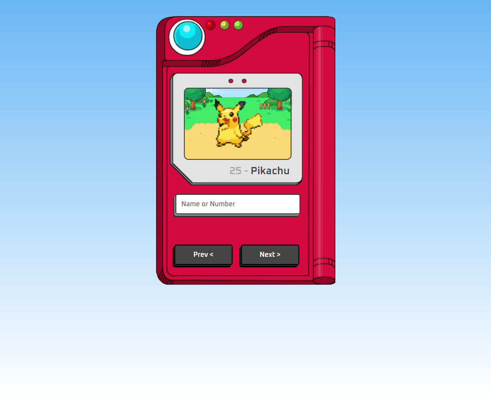

# 🎴 Pokedex

> Projeto desenvolvido através de um vídeo no YouTube

Neste projeto aprendi um pouco do básico sobre JS. Consegui aprender ainda mais sobre HTML e CSS.

[🔗 Clique aqui para acessar](https://lmagalhaes98.github.io/pokedex/)

## 💻 Tecnologias usadas neste projeto

 
  
  
  

